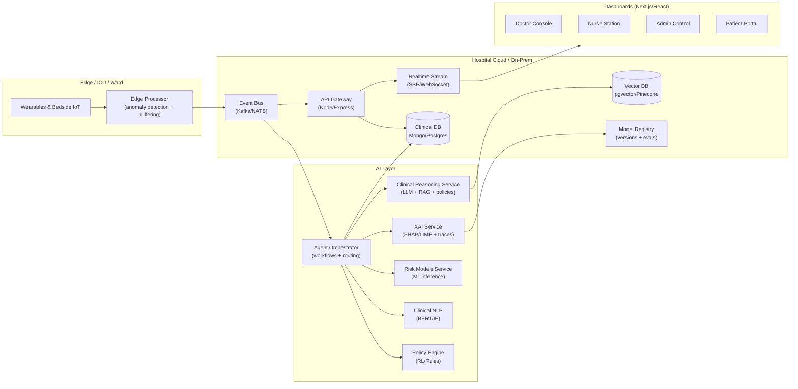
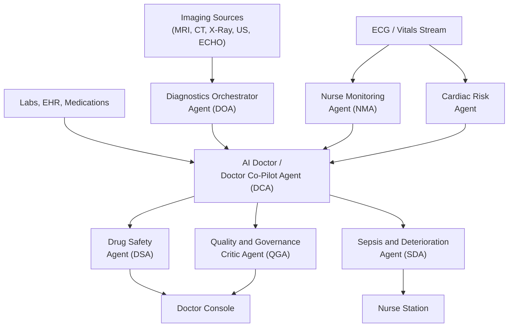

# Multi-Agent Smart Hospital System — Architecture & Roadmap

This document describes a production-grade, cloud-native design for an **Explainable Multi-Agent Hospital Brain**: a distributed, self-learning AI co-pilot that orchestrates Doctor, Nurse, DrugChecker, and Admin agents on top of **event-driven real-time monitoring**, **RAG-enabled clinical reasoning**, and **governance + explainability**.

Repository note (current state):
- Node/Express API already exposes: EHR, vitals, lab, pharmacy, agents, and SSE events.
- There is an in-repo event bus abstraction with a `KafkaMock`, and an agent orchestrator that consumes/publishes topics.
- There are separate Python services in this repo for agent workflows and ML.

---

## 1) Goals (Production Bar)

- **Safety first**: role-based access, auditability, and strong guardrails for AI outputs.
- **Real-time**: vitals streaming + alerting with low latency.
- **Explainable**: every recommendation carries provenance (retrieved sources + model attributions) and an audit trail.
- **Cloud-native**: horizontally scalable, resilient to partial failure, deployable across hospitals (tenant-aware, federated-ready).
- **Extensible**: config-driven prompts, tools, agent workflows, and event topics.

Non-goals (for v1):
- Fully automated care decisions without human confirmation.
- Replacing clinical judgment or providing medical advice without disclaimers/oversight.

---

## 2) System Context (High-Level)



---

## 3) Services (Microservice-Oriented, Monorepo-Friendly)

You can deploy these as separate services later, while keeping a monorepo for development.

### 3.1 API Gateway (Node/Express)
Responsibilities:
- Authentication (JWT), authorization (RBAC + patient-scoped access), request validation.
- Exposes REST endpoints for EHR/vitals/labs/pharmacy and agent workflows.
- Publishes/consumes events (initially in-process; later via Kafka/NATS).
- Serves SSE/WebSocket streams to the UI.

Existing repo alignment:
- `src/routes.ts` already registers routers.
- `src/events/*` already contains SSE + event bus abstraction.
- `src/modules/*` already contains domain modules and agent orchestrator.

### 3.2 Event Bus (Kafka/NATS)
Responsibilities:
- Durable, replayable, partitioned streams for vitals + clinical events.
- Backpressure handling and consumer groups for scalable agent processing.

Production mapping:
- Replace `KafkaMock` with Kafka/NATS client while retaining the same `publish/subscribe` interface.

Recommended topics (expand from existing):
- `vitals.stream` (high-frequency)
- `patient.updated`
- `lab.resulted`
- `pharmacy.prescribed`
- `sepsis.alert`, `deterioration.alert`
- `drug.warning`
- `agent.debate.trace`, `agent.decision.audit`
- `model.inference`, `model.attribution`

### 3.3 Agent Orchestrator (Workflow Router)
Responsibilities:
- Routes events to the correct agents (Nurse/Doctor/Drug/Admin).
- Runs multi-step workflows (e.g., SepsisCare), with retries and idempotency.
- Emits structured audit events for governance.

Agent workflow patterns to support:
- **Reactive**: subscribe to `vitals.stream`, trigger `deterioration.alert`.
- **Request/response**: doctor clicks “Evaluate”, orchestrator runs ML + NLP + RAG + RL, returns an explainable bundle.
- **Debate loop**: multiple agents propose; a critic agent checks policy + evidence; require human approval for high-impact actions.

### 3.4 Clinical Reasoning Service (LLM + RAG + Policies)
Responsibilities:
- Retrieval-augmented reasoning over:
  - internal: hospital protocols, care pathways, patient history
  - external: curated guidelines and knowledge (ingested offline)
- **Config-driven** prompts, tools, and policies.
- Safety checks: citations required, uncertainty marking, contraindication checks, refusal rules.

### 3.5 ML/NLP/RL Services
Responsibilities:
- ML inference: risk scores (logistic regression / random forest), drift monitoring.
- NLP: clinical note parsing, entity extraction, contradiction detection.
- RL: adaptive policy suggestions (with constraints + human approval gates).

### 3.6 XAI + Governance Service
Responsibilities:
- SHAP/LIME feature attributions for risk predictions.
- Evidence/provenance store for RAG retrievals.
- Audit log of model versions, prompts, retrieved docs, and agent decision traces.

### 3.7 Data Layer
Suggested storage split:
- **Operational DB** (Mongo/Postgres): patients, vitals, labs, prescriptions, workflow logs.
- **Time-series** (optional): vitals at scale (Timescale/Influx).
- **Vector DB**: embeddings for guidelines, hospital SOPs, and patient-note chunks.
- **Object storage**: lab PDFs and artifacts.

---

## 4) Config-Driven RAG (Design)

RAG must be configurable without redeploying code. A recommended pattern:

**`rag.config.(json|yaml|ts)`**
- `corpora`: documents + ACL labels (e.g., `guidelines`, `hospital_protocols`, `unit_sop`, `patient_records`)
- `retrieval`: topK, MMR, filters, recency bias, section weighting
- `promptTemplates`: per role/workflow (doctor vs nurse vs admin)
- `policies`: hard rules (no definitive diagnosis, require citations, contraindication checks)
- `tools`: enabled tool list (drug checker, lab summarizer, FHIR mapper)
- `outputSchema`: zod/json-schema for typed outputs

**Explainable output bundle**
- `answer.summary`
- `answer.recommendations[]`
- `evidence[]` (doc ids, snippets, timestamps, patient scope)
- `safety` (uncertainty, contraindications, missing data)
- `audit` (prompt version, model id, retrieval params)

---

## 5) Edge Computing + IoT (Simulation & Production)

### 5.1 Production approach
- Edge device ingests vitals (BLE/MQTT/HL7), performs:
  - smoothing + missingness handling
  - lightweight anomaly detection
  - offline buffering and resend
- Publishes events to the central event bus.

### 5.2 Simulation (for this repo)
Implement a mock pipeline:
- `mqtt-mock` (publisher): generates vitals for patient ids and publishes to an MQTT broker.
- `edge-bridge` (subscriber): subscribes to MQTT, runs anomaly detector, publishes `vitals.stream` to the event bus/API.

Why MQTT mock:
- Demonstrates low-latency edge behavior.
- Enables “disconnect/reconnect” scenarios.

---

## 6) Federated Learning (Framework Outline)

Federated-ready design principles:
- Each hospital (tenant) trains locally on its data.
- Only model updates / encrypted representations are shared.
- Central aggregator performs secure aggregation + evaluation.

Components:
- **Client trainer**: runs per-hospital training jobs, exports deltas.
- **Aggregator**: secure aggregation + global update.
- **Model registry**: versioning, metrics, approval gates.
- **Validation harness**: bias checks, calibration, site generalization.

Practical roadmap:
- Start with “multi-site simulation” in a single cluster (separate datasets).
- Add secure aggregation + DP later.

---

## 7) Explainable AI Dashboard (Frontend)

Front-end (Next.js/React/TS) should provide role-based pages:

Doctor Console:
- Patient timeline (vitals + labs + notes)
- “Evaluate” action returning explainable bundle (risk + evidence + recommended action)
- Alert center with severity + provenance

Nurse Station:
- Live vitals feed + device connectivity
- Rapid triage alerts + playbooks

Admin Control:
- Agent mesh health + queue lag
- Audit trails + access logs
- Model registry + drift metrics

Patient Portal:
- Simplified vitals, reports, prescriptions, messages (no internal model details)

XAI views to include:
- Feature importance for risk score (SHAP-style bars)
- “Why this recommendation” trace: retrieved docs + rules triggered
- Model version + evaluation summary

---

## 8) Security, Governance, and Guardrails

Minimum production controls:
- RBAC by role + **patient-scoped authorization** (doctor/nurse assignments).
- Audit everything:
  - who requested inference
  - which data was accessed
  - which model/prompt version was used
  - what evidence was retrieved
- Human-in-the-loop gates:
  - high-risk admissions/treatment changes require explicit clinician approval.
- Data governance:
  - encryption at rest/in transit
  - retention rules for streams and logs
  - redaction of PII from free-text outputs where appropriate

---

## 9) Implementation Roadmap (Concrete Upgrades)

### Phase 0 (Quick wins: 1–3 days)
- Standardize event envelopes: `{ id, topic, tenantId, patientId, at, payload, traceId }`.
- Add idempotency keys for agent workflows.
- Expand topic list and add structured severity levels for alerts.
- Add Admin “Agent Health” endpoint + UI card (connected, lag, last seen).

### Phase 1 (Production core: 1–2 weeks)
- Replace `KafkaMock` with a real bus (Kafka/NATS) behind the same interface.
- Introduce a **Clinical Reasoning Service** boundary:
  - config-driven prompts + output schema validation
  - evidence store
- Add XAI output bundle to Doctor evaluation response.
- Add a model registry table (version, metrics, approval status).

### Phase 2 (Edge + federated-ready: 2–4 weeks)
- MQTT mock + edge bridge + anomaly detector.
- Add tenant isolation (hospitalId) to all data and events.
- Multi-site training simulation (federated skeleton), store metrics per site.

### Phase 3 (Advanced agent intelligence: 4–8 weeks)
- Multi-agent debate loop with a “critic” agent and policy guardrails.
- Tool-based reasoning: drug interactions, contraindication checks, guideline retrieval.
- Continuous evaluation: golden set + regression tests for prompts/models.

---

## 10) Suggested Folder Structure (Target)

```text
backend/
  services/
    api-gateway/
    clinical-reasoning/        # LLM + RAG + policies
    xai-governance/            # attributions + audit + model registry
    edge-bridge/               # MQTT -> event bus
    federated-orchestrator/    # aggregator + eval harness
  packages/
    event-bus/                 # kafka/nats adapter, typed topics
    schemas/                   # zod schemas for all events + outputs
frontend2/
  app/
    login/  [slug]/ dashboards
  components/
    hospital-os/  ui/
  lib/
    api.ts  auth.ts  hospital-data.ts
```

---

## 11) What to Build Next (Recommended)

If you want the fastest visible “medical intelligence” impact:
1) **Doctor Evaluate v2**: return `{ riskScore, recommendedAction, evidence[], attributions[], audit[] }`.
2) **Alert Triage UI**: unify `high_risk_alert` + `drug_alert` into a single triage panel with severity, evidence, and “acknowledge” actions.
3) **Admin Agent Mesh**: show per-topic throughput, consumer lag, and “last agent heartbeat”.


---

## 12) Hospital Imaging & Monitoring Capabilities

This section documents the hospital's diagnostic imaging modalities and continuous monitoring equipment, and describes precisely how each data source is integrated into the multi-agent AI OS (Diagnostics Orchestrator Agent, Cardiac Risk Agents, Nurse Monitoring Agent, etc.).

---

### 12.1 MRI — Comfort-Optimised Imaging

Our MRI system combines advanced noise-reduction technology with a wide-bore design to significantly enhance patient comfort during scans. The quieter operation and spacious bore help reduce anxiety and motion artefacts, enabling high-quality imaging even for claustrophobic or elderly patients.

**AI OS Integration:**
Within the multi-agent hospital OS, MRI results are ingested by the **Diagnostics Orchestrator Agent (DOA)** and imaging AI models, which can pre-highlight suspicious regions and generate structured summaries for the doctor console while maintaining full human oversight.

- **Event emitted:** `order.imaging.resulted` (modality: `MRI`)
- **Consuming agents:** DOA → Doctor Co-Pilot Agent (DCA)
- **Output:** structured radiology summary + annotated finding flags pushed to Doctor Console

---

### 12.2 CT — Low-Dose High-Speed Cardiac CT

The hospital uses a **160-slice CT scanner** designed for rapid, sharp imaging with minimal radiation dose. Its low-dose protocols enable high-resolution cardiac and whole-body scans while prioritising patient safety, making it suitable for emergency and high-throughput settings.

**AI OS Integration:**
CT series and reports are streamed into the AI OS, where **Sepsis/Deterioration (SDA)** and **Cardiac Risk Agents** use them alongside vitals and labs to refine risk scores and treatment recommendations in real time.

- **Event emitted:** `order.imaging.resulted` (modality: `CT`)
- **Consuming agents:** DOA → SDA, Cardiac Risk Agent
- **Output:** updated risk score bundle; critical-finding alerts pushed to nurse + doctor dashboards

---

### 12.3 Mammogram — Low-Dose Digital Mammography

Our full-field digital mammography system delivers highly accurate breast imaging in under five minutes, using low-dose techniques that achieve approximately **20% lower radiation** than typical mammography systems. This improves patient safety without compromising diagnostic sensitivity.

**AI OS Integration:**
The **AI Doctor** accesses mammography reports and, where available, AI-assisted CAD outputs to support early breast-cancer detection, automatically checking that guideline-recommended follow-ups and repeat screenings are suggested and not missed in the workflow.

- **Event emitted:** `order.imaging.resulted` (modality: `MAMMOGRAM`)
- **Consuming agents:** DOA → DCA (guideline check via RAG)
- **Output:** structured screening summary; follow-up reminders auto-generated and attached to patient timeline

---

### 12.4 Digital X-Ray — Automated Self-Adjusting Imaging

The digital X-ray platform is equipped with **automated self-adjustment of exposure parameters**, enabling faster, smoother imaging with consistent quality across patients and body regions. This reduces repeat shots, improves throughput, and enhances patient comfort.

**AI OS Integration:**
The OS ingests X-ray images and radiology findings so the **Diagnostics Orchestrator Agent** can prioritise critical findings and push alerts (e.g., suspected pneumothorax or fractures) to doctor and nurse dashboards for rapid response.

- **Event emitted:** `order.imaging.resulted` (modality: `XRAY`)
- **Consuming agents:** DOA → NMA (nurse alert), DCA
- **Output:** critical-finding flag (pneumothorax, effusion, fracture) → severity-coded alert in Alert Center

---

### 12.5 Ultrasound — SuperOS-Powered Advanced Imaging

Our ultrasound systems use advanced imaging innovations powered by the SuperOS-style AI layer, setting a new benchmark in accuracy and detail for soft-tissue and vascular assessments. Real-time measurements and structured findings are automatically extracted and attached to the patient timeline.

**AI OS Integration:**
The **AI Doctor** uses this structured ultrasound data (e.g., ejection fraction, valve status, organ measurements, Doppler patterns) to refine differential diagnoses and suggest next-step investigations in an explainable, guideline-aware manner.

- **Event emitted:** `order.imaging.resulted` (modality: `ULTRASOUND`)
- **Consuming agents:** DOA → DCA (differential refinement), Cardiac Risk Agent (if cardiac view)
- **Structured fields extracted:** ejection fraction, valve status, organ size measurements, Doppler indices

---

### 12.6 2D ECHO — High-Fidelity Cardiac Assessment

The 2D ECHO platform uses industry-leading technology to capture detailed images of cardiac structure and function, enabling accurate assessment of valves, chambers, and wall motion. This is essential for diagnosing heart failure, valvular disease, and cardiomyopathies.

**AI OS Integration:**
Echo measurements are fed into specialised **Cardiac Risk Agents** that combine imaging, ECG, and lab data to generate personalised risk profiles and evidence-backed treatment suggestions, always requiring cardiologist approval before action.

- **Event emitted:** `order.imaging.resulted` (modality: `ECHO_2D`)
- **Consuming agents:** Cardiac Risk Agent → DCA → QGA (governance check)
- **Guardrail:** all treatment recommendations require explicit cardiologist confirmation; QGA logs acceptance/override

---

### 12.7 ECG — Precision Cardiac Monitoring

Our ECG systems are designed for precision cardiac monitoring and quick detection of rhythm irregularities. Rapid acquisition and clear visualisation support fast triage in emergency and ward settings.

**AI OS Integration:**
ECG streams are continuously monitored by the **Nurse Monitoring Agent (NMA)** and Cardiac Agents to detect arrhythmias or ischaemic changes early, triggering alerts in the nurse station and doctor console when concerning patterns appear.

- **Event emitted:** `vitals.stream` (type: `ECG_WAVEFORM`) or `ecg.resulted`
- **Consuming agents:** NMA (real-time rhythm monitoring), Cardiac Risk Agent
- **Output:** arrhythmia / ST-change alert → `deterioration.alert` → nurse station + doctor console

---

### 12.8 AI Doctor — Intelligent Consultant Agent

On top of these imaging and monitoring sources, the system deploys an **AI Doctor** — a specialised consultant agent built as part of the intelligent AI Operating System for healthcare, inspired by SuperOS-like agentic hospital OS designs. The AI Doctor does not replace clinicians; instead, it acts as an always-available co-pilot.

#### What the AI Doctor Reads

| Source | Data |
|---|---|
| EHR | diagnoses, history, allergies |
| Labs | CBC, metabolic panel, cultures, biomarkers |
| Medications | current Rx, allergy flags |
| Vitals | HR, BP, SpO2, RR, temperature (from NMA stream) |
| Imaging | MRI / CT / X-ray / Ultrasound / ECHO reports + CAD flags |
| ECG | rhythm analysis, ST changes |

#### How the AI Doctor Reasons

Uses **multi-agent clinical reasoning** (LLM + RAG + ML/RL) to synthesise the full picture for each patient:
- Retrieves relevant clinical guidelines and hospital SOPs via RAG (Vector DB).
- Runs ML risk models (SVM / Random Forest / Logistic Regression) for severity stratification.
- Applies RL-derived treatment policy suggestions (always subject to hard clinical constraints).
- Produces a typed **explainable output bundle**:

```json
{
  "summary": "...",
  "recommendations": [{ "action": "...", "priority": "high", "requiredApprover": "doctor" }],
  "evidence": [{ "source": "guideline_id", "snippet": "...", "relevance": 0.92 }],
  "safety": { "uncertainties": [".."], "contraindications": [".."], "missingData": [".."] },
  "audit": { "modelVersion": "...", "promptVersion": "...", "retrievalParams": {} }
}
```

#### Capabilities

**1. Consultant-Level Q&A**
Trained on clinical guidelines, hospital protocols, and curated reference material, the AI Doctor can answer most routine and many complex questions at the point of care, in natural language, with multi-lingual support (including multiple Indian languages) similar to SuperOS deployments. It supports doctors, nurses, and admin staff with context-aware explanations — not generic textbook answers — because it sees live patient data from all modalities.

**2. Case Summary & Second-Opinion Support**
Given a patient, the AI Doctor creates concise case summaries integrating MRI/CT/X-ray/US/ECHO/ECG findings with labs, vitals, and history. It provides a structured second-opinion reasoning chain:
- "Most likely diagnosis" with evidence weight
- "Other possibilities" ranked by probability
- "What evidence supports / contradicts each hypothesis"

**3. Workflow & Safety Integration**
Every suggestion from the AI Doctor is checked by the **Drug Safety Agent (DSA)**, **Sepsis/Deterioration Agent (SDA)**, and **Quality & Governance Critic Agent (QGA)** before being surfaced — ensuring contraindications or guideline violations are flagged before a clinician sees them.

High-risk decisions (escalation of care, chemotherapy regimen changes, high-risk drug combinations) always require **explicit human confirmation**. All AI outputs and human overrides are logged for audit and continuous learning.

**4. Continuous Learning**
As real-case outcomes accumulate, the AI Doctor and its underlying models are retrained under strict governance to improve accuracy, reduce bias, and adapt to local population patterns — consistent with the federated-ready design in Section 6 and the research methodology for multi-agent hospital systems.

#### Agent Interaction Map



> **Safety note:** The AI Doctor acts strictly as a decision-support tool. It never initiates treatment autonomously. All recommendations carry uncertainty scores, evidence citations, and require explicit clinician sign-off before any clinical action is taken.
