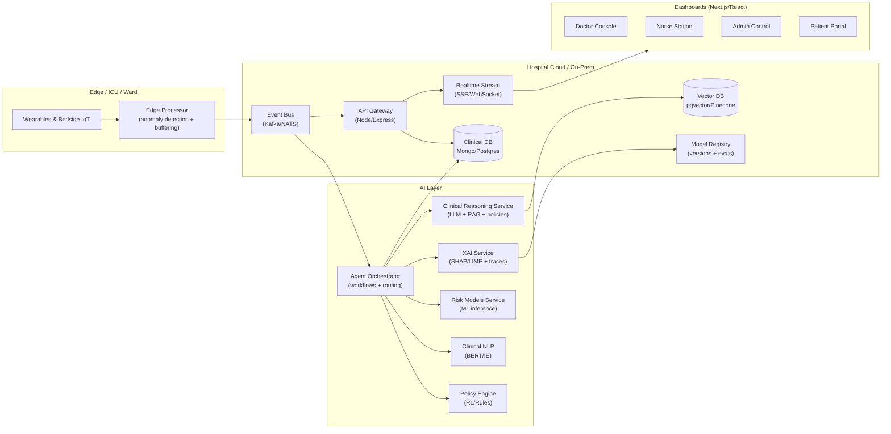

# Multi-Agent Smart Hospital System — Architecture & Roadmap

This document describes a production-grade, cloud-native design for an **Explainable Multi-Agent Hospital Brain**: a distributed, self-learning AI co-pilot that orchestrates Doctor, Nurse, DrugChecker, and Admin agents on top of **event-driven real-time monitoring**, **RAG-enabled clinical reasoning**, and **governance + explainability**.

Repository note (current state):
- Node/Express API already exposes: EHR, vitals, lab, pharmacy, agents, and SSE events.
- There is an in-repo event bus abstraction with a `KafkaMock`, and an agent orchestrator that consumes/publishes topics.
- There are separate Python services in this repo for agent workflows and ML.

---

## 1) Goals (Production Bar)

- **Safety first**: role-based access, auditability, and strong guardrails for AI outputs.
- **Real-time**: vitals streaming + alerting with low latency.
- **Explainable**: every recommendation carries provenance (retrieved sources + model attributions) and an audit trail.
- **Cloud-native**: horizontally scalable, resilient to partial failure, deployable across hospitals (tenant-aware, federated-ready).
- **Extensible**: config-driven prompts, tools, agent workflows, and event topics.

Non-goals (for v1):
- Fully automated care decisions without human confirmation.
- Replacing clinical judgment or providing medical advice without disclaimers/oversight.

---

## 2) System Context (High-Level)



---

## 3) Services (Microservice-Oriented, Monorepo-Friendly)

You can deploy these as separate services later, while keeping a monorepo for development.

### 3.1 API Gateway (Node/Express)
Responsibilities:
- Authentication (JWT), authorization (RBAC + patient-scoped access), request validation.
- Exposes REST endpoints for EHR/vitals/labs/pharmacy and agent workflows.
- Publishes/consumes events (initially in-process; later via Kafka/NATS).
- Serves SSE/WebSocket streams to the UI.

Existing repo alignment:
- `src/routes.ts` already registers routers.
- `src/events/*` already contains SSE + event bus abstraction.
- `src/modules/*` already contains domain modules and agent orchestrator.

### 3.2 Event Bus (Kafka/NATS)
Responsibilities:
- Durable, replayable, partitioned streams for vitals + clinical events.
- Backpressure handling and consumer groups for scalable agent processing.

Production mapping:
- Replace `KafkaMock` with Kafka/NATS client while retaining the same `publish/subscribe` interface.

Recommended topics (expand from existing):
- `vitals.stream` (high-frequency)
- `patient.updated`
- `lab.resulted`
- `pharmacy.prescribed`
- `sepsis.alert`, `deterioration.alert`
- `drug.warning`
- `agent.debate.trace`, `agent.decision.audit`
- `model.inference`, `model.attribution`

### 3.3 Agent Orchestrator (Workflow Router)
Responsibilities:
- Routes events to the correct agents (Nurse/Doctor/Drug/Admin).
- Runs multi-step workflows (e.g., SepsisCare), with retries and idempotency.
- Emits structured audit events for governance.

Agent workflow patterns to support:
- **Reactive**: subscribe to `vitals.stream`, trigger `deterioration.alert`.
- **Request/response**: doctor clicks “Evaluate”, orchestrator runs ML + NLP + RAG + RL, returns an explainable bundle.
- **Debate loop**: multiple agents propose; a critic agent checks policy + evidence; require human approval for high-impact actions.

### 3.4 Clinical Reasoning Service (LLM + RAG + Policies)
Responsibilities:
- Retrieval-augmented reasoning over:
  - internal: hospital protocols, care pathways, patient history
  - external: curated guidelines and knowledge (ingested offline)
- **Config-driven** prompts, tools, and policies.
- Safety checks: citations required, uncertainty marking, contraindication checks, refusal rules.

### 3.5 ML/NLP/RL Services
Responsibilities:
- ML inference: risk scores (logistic regression / random forest), drift monitoring.
- NLP: clinical note parsing, entity extraction, contradiction detection.
- RL: adaptive policy suggestions (with constraints + human approval gates).

### 3.6 XAI + Governance Service
Responsibilities:
- SHAP/LIME feature attributions for risk predictions.
- Evidence/provenance store for RAG retrievals.
- Audit log of model versions, prompts, retrieved docs, and agent decision traces.

### 3.7 Data Layer
Suggested storage split:
- **Operational DB** (Mongo/Postgres): patients, vitals, labs, prescriptions, workflow logs.
- **Time-series** (optional): vitals at scale (Timescale/Influx).
- **Vector DB**: embeddings for guidelines, hospital SOPs, and patient-note chunks.
- **Object storage**: lab PDFs and artifacts.

---

## 4) Config-Driven RAG (Design)

RAG must be configurable without redeploying code. A recommended pattern:

**`rag.config.(json|yaml|ts)`**
- `corpora`: documents + ACL labels (e.g., `guidelines`, `hospital_protocols`, `unit_sop`, `patient_records`)
- `retrieval`: topK, MMR, filters, recency bias, section weighting
- `promptTemplates`: per role/workflow (doctor vs nurse vs admin)
- `policies`: hard rules (no definitive diagnosis, require citations, contraindication checks)
- `tools`: enabled tool list (drug checker, lab summarizer, FHIR mapper)
- `outputSchema`: zod/json-schema for typed outputs

**Explainable output bundle**
- `answer.summary`
- `answer.recommendations[]`
- `evidence[]` (doc ids, snippets, timestamps, patient scope)
- `safety` (uncertainty, contraindications, missing data)
- `audit` (prompt version, model id, retrieval params)

---

## 5) Edge Computing + IoT (Simulation & Production)

### 5.1 Production approach
- Edge device ingests vitals (BLE/MQTT/HL7), performs:
  - smoothing + missingness handling
  - lightweight anomaly detection
  - offline buffering and resend
- Publishes events to the central event bus.

### 5.2 Simulation (for this repo)
Implement a mock pipeline:
- `mqtt-mock` (publisher): generates vitals for patient ids and publishes to an MQTT broker.
- `edge-bridge` (subscriber): subscribes to MQTT, runs anomaly detector, publishes `vitals.stream` to the event bus/API.

Why MQTT mock:
- Demonstrates low-latency edge behavior.
- Enables “disconnect/reconnect” scenarios.

---

## 6) Federated Learning (Framework Outline)

Federated-ready design principles:
- Each hospital (tenant) trains locally on its data.
- Only model updates / encrypted representations are shared.
- Central aggregator performs secure aggregation + evaluation.

Components:
- **Client trainer**: runs per-hospital training jobs, exports deltas.
- **Aggregator**: secure aggregation + global update.
- **Model registry**: versioning, metrics, approval gates.
- **Validation harness**: bias checks, calibration, site generalization.

Practical roadmap:
- Start with “multi-site simulation” in a single cluster (separate datasets).
- Add secure aggregation + DP later.

---

## 7) Explainable AI Dashboard (Frontend)

Front-end (Next.js/React/TS) should provide role-based pages:

Doctor Console:
- Patient timeline (vitals + labs + notes)
- “Evaluate” action returning explainable bundle (risk + evidence + recommended action)
- Alert center with severity + provenance

Nurse Station:
- Live vitals feed + device connectivity
- Rapid triage alerts + playbooks

Admin Control:
- Agent mesh health + queue lag
- Audit trails + access logs
- Model registry + drift metrics

Patient Portal:
- Simplified vitals, reports, prescriptions, messages (no internal model details)

XAI views to include:
- Feature importance for risk score (SHAP-style bars)
- “Why this recommendation” trace: retrieved docs + rules triggered
- Model version + evaluation summary

---

## 8) Security, Governance, and Guardrails

Minimum production controls:
- RBAC by role + **patient-scoped authorization** (doctor/nurse assignments).
- Audit everything:
  - who requested inference
  - which data was accessed
  - which model/prompt version was used
  - what evidence was retrieved
- Human-in-the-loop gates:
  - high-risk admissions/treatment changes require explicit clinician approval.
- Data governance:
  - encryption at rest/in transit
  - retention rules for streams and logs
  - redaction of PII from free-text outputs where appropriate

---

## 9) Implementation Roadmap (Concrete Upgrades)

### Phase 0 (Quick wins: 1–3 days)
- Standardize event envelopes: `{ id, topic, tenantId, patientId, at, payload, traceId }`.
- Add idempotency keys for agent workflows.
- Expand topic list and add structured severity levels for alerts.
- Add Admin “Agent Health” endpoint + UI card (connected, lag, last seen).

### Phase 1 (Production core: 1–2 weeks)
- Replace `KafkaMock` with a real bus (Kafka/NATS) behind the same interface.
- Introduce a **Clinical Reasoning Service** boundary:
  - config-driven prompts + output schema validation
  - evidence store
- Add XAI output bundle to Doctor evaluation response.
- Add a model registry table (version, metrics, approval status).

### Phase 2 (Edge + federated-ready: 2–4 weeks)
- MQTT mock + edge bridge + anomaly detector.
- Add tenant isolation (hospitalId) to all data and events.
- Multi-site training simulation (federated skeleton), store metrics per site.

### Phase 3 (Advanced agent intelligence: 4–8 weeks)
- Multi-agent debate loop with a “critic” agent and policy guardrails.
- Tool-based reasoning: drug interactions, contraindication checks, guideline retrieval.
- Continuous evaluation: golden set + regression tests for prompts/models.

---

## 10) Suggested Folder Structure (Target)

```text
backend/
  services/
    api-gateway/
    clinical-reasoning/        # LLM + RAG + policies
    xai-governance/            # attributions + audit + model registry
    edge-bridge/               # MQTT -> event bus
    federated-orchestrator/    # aggregator + eval harness
  packages/
    event-bus/                 # kafka/nats adapter, typed topics
    schemas/                   # zod schemas for all events + outputs
frontend/
  app/
    doctor/ nurse/ admin/ patient/
  components/
    layout/ agents/ xai/ monitoring/
```

---

## 11) What to Build Next (Recommended)

If you want the fastest visible “medical intelligence” impact:
1) **Doctor Evaluate v2**: return `{ riskScore, recommendedAction, evidence[], attributions[], audit[] }`.
2) **Alert Triage UI**: unify `high_risk_alert` + `drug_alert` into a single triage panel with severity, evidence, and “acknowledge” actions.
3) **Admin Agent Mesh**: show per-topic throughput, consumer lag, and “last agent heartbeat”.

